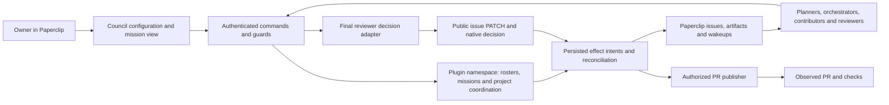

# Paperclip Council — V1 technical architecture

Version 0.4 — October 1, 2026. **Design for bounded implementation; runtime qualification pending.**

Product authority: [PRD 0.5](PRD.md) and [V1 scope](V1-SCOPE.md). Sequence and exit checks: [implementation plan](IMPLEMENTATION-PLAN.md). Proposed responsibilities: [agent catalogue](AGENT-CATALOG.md). This document specifies contracts, not installed behavior or authorization to operate an instance.

Environment classes and proof-promotion boundaries are normative in
[`ENVIRONMENTS.md`](ENVIRONMENTS.md). In particular, the repo-owned sandbox and
the read-only integrated Paperclip recipe are distinct environments.

## 1. Baseline and evidence

Source inspection used native WSL files and Git objects; no build, test, provider request, installation or live API mutation was performed for this TAD. The initial documentary base was Council `365809efdf190010f818a25b938bad59ebd4f33c`. Publication is based on main at `9d7d0e0efd21d8385f10fea018e3e4c0697eaf30`, which already contains the standalone adapter, manifest gate and current-candidate validation fix. The following sources were inspected; historical commits remain evidence of their own revisions:

| Ref | Source and claim supported by inspection | Limit |
| --- | --- | --- |
| S1 | [Paperclip `61b3fd5` plugin authoring guide](https://github.com/paperclipai/paperclip/blob/61b3fd57a695614dc4a37e2303f426a34a9795cf/doc/plugins/PLUGIN_AUTHORING_GUIDE.md): scoped routes, plugin SQL namespace, migrations and UI extensions | Source contract; target runtime not inspected |
| S2 | [SDK types](https://github.com/paperclipai/paperclip/blob/61b3fd57a695614dc4a37e2303f426a34a9795cf/packages/plugins/sdk/src/types.ts): `db.query/execute`, issues, documents, interactions, attachments, origin metadata, wakeups and maintenance jobs | Installed SDK parity and all required capabilities must pass G1 |
| S3 | [Plugin database service](https://github.com/paperclipai/paperclip/blob/61b3fd57a695614dc4a37e2303f426a34a9795cf/server/src/services/plugin-database.ts): one restricted runtime SQL statement; namespace-local writes; affected row count | No worker-facing multi-call transaction API; SQL design below must be exercised through the real bridge |
| S4 | [Native review transition service](https://github.com/paperclipai/paperclip/blob/61b3fd57a695614dc4a37e2303f426a34a9795cf/server/src/services/issue-execution-policy.ts), [validator](https://github.com/paperclipai/paperclip/blob/61b3fd57a695614dc4a37e2303f426a34a9795cf/packages/shared/src/validators/issue.ts), [tests](https://github.com/paperclipai/paperclip/blob/61b3fd57a695614dc4a37e2303f426a34a9795cf/server/src/__tests__/issue-execution-policy.test.ts) | One active reviewer; `approvalsNeeded` is 1. Tests inspected, not run. Native stage alternatives do not implement collective review |
| S5 | [Plugin routes](https://github.com/paperclipai/paperclip/blob/61b3fd57a695614dc4a37e2303f426a34a9795cf/server/src/routes/plugins.ts), [public issue route](https://github.com/paperclipai/paperclip/blob/61b3fd57a695614dc4a37e2303f426a34a9795cf/server/src/routes/issues.ts), [host SDK services](https://github.com/paperclipai/paperclip/blob/61b3fd57a695614dc4a37e2303f426a34a9795cf/server/src/services/plugin-host-services.ts) | Host-derived company/actor context is available; SDK issue update is not equivalent to the public execution-policy transition path |
| S6 | [Interaction resolver](https://github.com/paperclipai/paperclip/blob/61b3fd57a695614dc4a37e2303f426a34a9795cf/server/src/services/issue-thread-interaction-resolution.ts), [interaction service](https://github.com/paperclipai/paperclip/blob/61b3fd57a695614dc4a37e2303f426a34a9795cf/server/src/services/issue-thread-interactions.ts) | `human_only` and addressed user are source-supported; system resolution is possible, so Council must also verify the actual owner responder |
| S7 | [Team catalogue routes](https://github.com/paperclipai/paperclip/blob/61b3fd57a695614dc4a37e2303f426a34a9795cf/server/src/routes/teams-catalog.ts) | Preview/install/installed catalogue surfaces exist; they do not by themselves prove Council roster, mandate or voting semantics |
| S8 | Council extraction commit `cfc316625ef4b097126c86d7123a13d00df905b9` and [manifest-gate commit `7a7ba2416cd54fb25d4d51ee16acf07ae7e923fa`](https://github.com/ty000/paperclip-council/tree/7a7ba2416cd54fb25d4d51ee16acf07ae7e923fa), inspected through local Git objects: `package.json`, `src/worker.ts`, `src/manifest.ts`, `src/delivery-manifest.ts`, README | Existing adapter 0.1.1 pins SDK/shared `2026.916.1`, pnpm 9.15.4 and Node >=24.11. Gate compares request/manifest commit and attachment SHA metadata; it does not read bundle bytes, aggregate opinions or reconcile application |

Publication refresh: [Council main at `9d7d0e0`](https://github.com/ty000/paperclip-council/tree/9d7d0e0efd21d8385f10fea018e3e4c0697eaf30) additionally rejects mismatched current/primary work-product candidates when that projection is supplied. Inspection of `src/delivery-manifest.ts`, `src/worker.ts` and README confirms that bundle byte verification, collective review and application reconciliation remain V1 work. The pinned host still lacks the work-product projection through this SDK bridge; no wider runtime guarantee follows from this fix.

The existing untracked integration review in the original checkout remains unchanged historical context. It predates S8 and is not copied into this branch. Reports of earlier deterministic and real-agent demonstrations are historical, not fresh verification. Links are pinned source references, not claims that unpublished local reports are public.

## 2. Architecture decisions

| ID | Decision and rationale | PRD |
| --- | --- | --- |
| D01 | Extend the existing TypeScript Paperclip plugin; reuse its public-PATCH decision adapter after integrating the separate code baseline. No new agent execution engine or backend service | C01–C04 |
| D02 | Paperclip owns agents, runs, issue checkout, native issue status and artifacts. Council owns rosters, mandate snapshots, technical plans, coordination, opinion aggregation and its decision/application record. Executive supplies optional methods/profiles, not another dispatcher or verdict writer | C02, C10, C16–C22 |
| D03 | Use the host-managed plugin SQL namespace and immutable roster revisions. Store each mission's authoritative state, journal and effect intents in one versioned aggregate row | C05, C17–C18 |
| D04 | Use compare-and-swap (CAS) for every mission command; persist external-effect intent in the same row change. Do not assume an atomic transaction spanning plugin state and Paperclip's public API | C04–C05 |
| D05 | One accountable final reviewer owns one native root review stage. Specialists use separate child review issues and submit authenticated opinions; no native multi-vote interpretation | C02, C10–C11 |
| D06 | Bind each review to an immutable candidate tuple and evidence revision. Preserve the manifest gate, add byte/content checks and mission revision guards | C03–C04 |
| D07 | Reserved owner decisions use addressed `human_only` interactions plus verified owner identity and result/mandate binding. Silence or system resolution is insufficient | C01, C05 |
| D08 | Reconciliation reads native evidence after ambiguous effects; it never retries an unproven approval solely because a timeout elapsed | C04–C06 |
| D09 | Use existing Paperclip agents and runtime instruction/context surfaces. No automatic agent provisioning or global instruction rewrite in V1 | C09, C17 |
| D10 | Minimal plugin UI within Paperclip, with native issue links, project coordination, mission/PR state and decision summaries; no memory engine or generic delivery platform | C07–C09, C21, C23 |
| D11 | Revisioned technical plans identify planner, orchestrator and integration owner; route by required skill, dependency and write ownership. Preserve independent review provenance | C19–C20 |
| D12 | Durable project coordination references native missions and serializes finite shared-capacity claims; mission dispatch remains with one accountable orchestrator | C21 |
| D13 | Facilitation is a bounded attributed work item on an observed blocker, with outcome and next actor; no additional approval hierarchy | C22 |
| D14 | A separate authorized PR effect binds accepted submission, repository/base/head and publisher; persist intent and reconcile ambiguity before retry. Acceptance and PR/check/review state are separate | C23 |

All paths carry the host-resolved company. V1 has one configured owner per company; every query, foreign reference and command must enforce company boundaries even though initial qualification uses a single company. A project restriction is additionally checked on missions and members' usable workspaces. Titles or instruction text never grant a permission.

## 3. Persistence and concurrency

### 3.1 Orchestration extension contracts — D11–D14

These contracts derive from PRD 0.5 and are not implemented or qualified by this document. Reuse the native issue model and existing persistence/effect rules. Select exact routes and schema changes in N5/N6 after checking the current host; no new scheduler service is assumed.

| Contract | Required information and behavior |
| --- | --- |
| Technical plan | Mission/mandate and plan revision; planner, orchestrator and integration owner; contribution skills, interfaces, dependencies, assignee, write scope and expected evidence. Replanning records reason and affected work; preserve valid unaffected evidence and rerun affected validation. |
| Project coordination | Company/project, owner delegation, coordinator, native mission references, ordering rationale, dependency result/evidence references, bounded capacity and active claims, waits and next actors. State and attributed decisions survive session replacement. |
| Facilitation | Named blocker, mission/project references, participants, expected outcome, operating limit, outcome and accountable next actor. Reuse bounded native work; no verdict, dispatch or priority authority is inferred from the facilitator title. |
| PR effect | Stable operation identity, accepted submission/evidence/mandate revision, repository, base, expected head, authorized publisher, permitted create/update action, pending/unknown/confirmed result and observed PR URL/head. Record check/review observations separately. |

Project coordination is operational state, not the deferred learning store. A versioned project coordination record must atomically claim finite shared capacity before a mission marks dispatch eligible; use CAS or an equivalent qualified host primitive. Claim identity is stable across project and mission records. A crash between those writes retains the claim conservatively; release requires evidence that no work was dispatched or that the in-flight work ended. Do not assume a transaction spanning project/mission/host state, free a claim merely on timeout, or bypass G4 budget admission. Shared resources must resolve to one claim authority; initial support may restrict them to one configured project. Unsupported cross-project sharing blocks affected dispatch instead of silently double-booking.

The Project Manager selects eligible mission ordering within delegation; one mission orchestrator dispatches eligible contributions. The planner proposes revisions and the named integration lead assembles the candidate. Existing native root assignment may remain with the integration lead; distinct orchestration/planning actors use their own supported assignments/commands and never impersonate that checkout. Bound dependency validation and refuse cycles or missing evidence. An external `done` status alone cannot release a dependency that requires an accepted candidate or published PR.

An authorized existing delivery path or task-scoped publisher may perform the PR effect; the provider path, credential boundary and supported readback must be selected and qualified before N5 publication. Do not duplicate an existing delivery trigger: one logical publication has one effect owner. Confirm repository/base/head against the accepted candidate before writing and read them back afterwards. Persist intent before dispatch; ambiguous creation/update stays unknown until correlated with the observed PR. A PR title match or absence from one stale read is insufficient grounds to create another.

PR state is an orthogonal delivery record: `not_requested`, `awaiting_authority`, `pending`, `unknown`, `opened` or `failed`, with separate check/review observations. Historical `accepted` remains attached to its exact candidate; it does not mean the current PR is ready. A code correction after acceptance opens a new attempt/review round for the same mission, using a qualified native reopen/child-work route. Preserve the old decision, invalidate affected current readiness and publish the changed head only after its required checks and acceptance. A known failed update may be corrected and retried within mandate after readback; an ambiguous effect may not. Merge/deployment automation is outside this contract.

Compatibility boundary: [Executive PRD 0.2](https://github.com/ty000/paperclip-executive/blob/404d62d/docs/PRD.md) assumes prepared product tickets and assigns Executive the review profiles/methods. Internal technical decomposition here does not recreate that upstream backlog. When composing plugins, bind Executive contributions to the same mission/candidate and choose one dispatch owner; this Council document does not assert that Executive implements the integration.

### 3.2 Existing mission persistence foundation

Use migrations in the plugin package under the host-derived namespace. Do not write Paperclip public tables, use direct DB credentials or install another database. The proposed physical layout deliberately avoids depending on unavailable multi-statement worker transactions (S3).

| Record | Required fields and integrity |
| --- | --- |
| `roster_revisions` | `(company_id, roster_id, revision)` primary key; kind team/council; project restriction; immutable JSON members, responsibility mapping, policy; creator and timestamp |
| `roster_heads` | `(company_id, roster_id)` key; published revision; draft/active/suspended/retired lifecycle; integer version; owner audit entries |
| `budget_envelopes` | `(company_id, envelope_id, period_id)` key; versioned known spend, active reservations, unknown exposure and limit policy; CAS serializes reservations across missions |
| `missions` | `(company_id, mission_id)` key; unique `(company_id, root_issue_id)`; integer version; JSON aggregate; timestamps. One mission per root issue in V1; a new attempt is recorded within it |

Publish a roster by first inserting an immutable revision, then CAS-updating its head to that existing revision. A crash may leave an unreferenced revision, never a head pointing at missing content. Active missions reference immutable revisions, not mutable heads. No cross-record transaction is needed for this publication contract. Native agent state is rechecked at dispatch; a roster snapshot is not a guarantee an agent remains available.

The mission aggregate contains: mandate and limit snapshot; owner; roster references; integration/final-reviewer identities; contribution plan and issue mappings; all submissions/evidence revisions; rounds/opinions/appeals; owner requests; final decisions; application attempts; operational journal; command receipts; pending external effects; measured usage and unknowns. Artifacts and full logs remain in Paperclip rather than copied into this JSON.

A command reads version N, validates invariants and computes the next aggregate. A single parameterized `UPDATE <namespace>.missions SET aggregate = ..., version = N+1 WHERE company_id = ... AND mission_id = ... AND version = N` commits the state, audit entry, command receipt and effect intents together. `rowCount == 1` wins; zero requires readback and either the existing receipt or a 409 revision conflict. No naked read-then-write, process-local mutex or assumed SDK `transaction()`.

Every command has `commandId`, `expectedVersion` and a canonical payload hash. Receipts bind company, mission, authenticated actor and hash. Same command/same payload returns its recorded result; same ID/different actor or payload is refused. State transitions also guard logical uniqueness, so using a new command ID cannot create a second active review or second approval for the same round. Timeouts may require polling a command result rather than resending with a new identity.

Aggregate-size and command/round limits must be finite and configurable. A limit blocks new work with an explanation; never silently trim the audit journal. Initial release does not promise unlimited mission history or unbounded team size. Historical evidence remains readable when a mission is stopped. A normalized multi-table event store can follow only if measured scale warrants it.

## 4. Mission states and invariants

Use a `phase` plus a control overlay (`active`, `suspend_requested`, `suspended`, `cancel_requested`, `cancelled`). This preserves what was in progress when suspension occurred. A terminal acceptance is historical and is not undone by retiring a roster.

| Phase | Allowed progression and guards |
| --- | --- |
| `draft` | Owner enables only with valid rosters, mandate, limits, workspace and native review path |
| `executing` | Integration lead creates/updates bounded contribution plan; dispatch respects dependencies and limits |
| `integrating` | Lead verifies required contributions and integrated checks; child `done` is not enough |
| `reviewing` | Frozen submission and evidence revision; active eligible final reviewer; required opinions collected |
| `awaiting_evidence` | Missing evidence is identified; new evidence revision invalidates dependent opinions/verdicts before re-review |
| `appealing` | One unresolved question, selected eligible perspectives, same submission and mandate; one appeal level |
| `awaiting_owner` | Addressed interaction and continuation are recorded; only dependent work waits |
| `decision_ready` | Required opinions present, material objections resolved, mandate facts/owner evidence valid; final reviewer signs verdict |
| `applying` | One persisted attempt owns the native mutation; block submission, reconfiguration and competing verdict commands |
| `application_unknown` | Native effect uncertain; no blind retry or new decision; reconciliation may confirm effect or require intervention |
| `correction_requested` | Confirm native correction/human handback first; reopen relevant contribution work, preserve earlier round |
| `accepted` | Matching native decision and covered terminal effect confirmed for the exact frozen submission |
| `blocked` / `failed` | Concrete reason, actor and resumable prior phase if recoverable; never displayed as accepted |

Core invariants: no self-acceptance; no cross-company references; no approval without complete required review and mandate disposition; no changed result inheriting a verdict; no owner approval by silence; no acceptance from child statuses; no native `done` alone treated as Council acceptance; no duplicate Council decision through retries.

New result bytes create a new submission and review round. New evidence alone increments its evidence revision; earlier opinions may be explicitly reaffirmed for that revision, with attribution and rationale, but are not counted automatically. A mandate or active participant change supersedes affected un-applied decisions and opinions. Reconfiguration during `applying`/`application_unknown` waits for reconciliation.

### N1-to-N2 integration boundary

N1 supplies an identified, verified integrated candidate; N2 consumes it for independent review and one ordinary correction/review/acceptance cycle. Bind the mission, mandate revision, submission/evidence revision, commit, bundle digest and eligible reviewer to each round. A correction creates a new submission and round while preserving the prior candidate and verdict; it cannot mutate the identity already reviewed or inherit its acceptance.

The [N1 profile at `9bedaa8`](https://github.com/ty000/paperclip-council/blob/9bedaa81d873d755ec679e174c70279118d8deef/src/g4-native.ts) has zero allowed corrections and requires exactly one expected native run per issue for settlement. N2 must qualify a supported correction route with explicit admission and effect/run identity. Do not assume another run on the same issue remains compatible with issue-aggregated usage, or count an accumulated total again as new consumption. Reuse the reservation and decision-receipt mechanisms; this boundary calls for a targeted continuation contract, not a second dispatcher, ledger or general recovery engine.

Develop this extension on an isolated N1-based branch while the N1 owner completes its changes. Resolve common-interface differences against the final N1 base before claiming the native N2 exit. Fixtures can test the extension in advance; they do not replace the qualified N1 candidate or the correction's observed native execution. [The sprint plan](SPRINT-PLAN.md#october-1-delivery-checkpoint) owns delivery sequencing.

## 5. Execution teams and council protocol

The root issue represents the integrated mission and remains assigned to the integration lead until native review handoff. Each contribution uses a child issue with one native assignee; dependencies are an acyclic graph checked before dispatch. The planner owns plan revisions, the orchestrator owns dispatch and the lead owns integration; one identity may hold these responsibilities. Agent unavailability or a cycle produces an explicit blocker. Use isolated workspaces/branches for concurrent writes, or explicitly serialize access; never assign conflicting writes to a shared checkout silently.

Council-managed child issues use stable `originKind`/`originId` correlation derived from mission and contribution/review slot. The SDK exposes these on create and list (S2). Their availability is not proof of a database uniqueness constraint: ambiguous issue creation requires correlation readback; if absence or uniqueness cannot be established, stop automatic creation and expose reconciliation. Do not issue another create simply because the first call timed out.

Before root handoff, establish one native review stage for the selected final reviewer, distinct from all recorded candidate authors. Exact public execution-policy payload and resulting ownership must be contract-tested against S4/S5. Root handoff and final application go through the public execution-policy path under a real eligible agent/run. Do not substitute `ctx.issues.update` for those transitions.

When review starts, create bounded specialist child issues for the required perspectives selected in the round. Specialist agents inspect the same immutable result; they return an opinion through a route addressed to their own review child issue, under its actual checkout/run. They must not claim the root issue or its final-reviewer credential. Child completion is not itself an opinion.

Opinion contract: `opinionId`, submission/evidence/mandate revisions, perspective, finding IDs, criterion-linked evidence references, `support`/`changes_requested`/`insufficient_evidence`, rationale and unresolved questions. Identity/run come from host authentication, not the body. Required slots are fixed before collection; removing a failed slot requires explicit reconfiguration and audit, never quiet quorum reduction.

The final reviewer produces a synthesis with the disposition of each material objection: upheld with correction, resolved by new evidence, rejected with reason, or escalated. This is an accountable judgment, not automatic majority voting. A blocked factual/authority issue cannot be overridden by consensus. Timeouts on required opinions wait, replace explicitly or escalate. Optional opinions arriving after a finalized round are historical input and cannot mutate its verdict.

An appeal has a unique question ID, original arguments, same submission/evidence/mandate, eligible participants, deadline and result. Do not count an author or the disputed opinion's issuer as its independent appellate reviewer. If the roster cannot provide an eligible reviewer, ask the owner. Keep one final native actor; no recursive appeals or silent authority transfer. A material new submission can be reviewed anew, but cannot reset the mission's total operating limits.

## 6. Result binding and existing manifest gate

S8 is useful existing code, not complete D06 enforcement. Preserve its structured `approvedCommit` check and `delivery-manifest` compatibility while strengthening V1's canonical submission:

`company + rootIssue + submissionId + repositoryIdentity + baseCommit + approvedCommit + bundleAttachmentId + bundleSha256 + evidenceRevision + mandateRevision`.

Copy validated manifest content and evidence references into the immutable submission record, rather than relying on the latest mutable issue document. Recheck document revision/content before application; a changed manifest cannot silently retarget acceptance. A branch name or workspace path is contextual, not the identity of approved bytes. Owner-configured allowed workspace roots replace any assumption that a hardcoded personal path is a portable contract; legacy external delivery compatibility must remain explicit.

Use the attachment-content API (S2) to read a size-bounded bundle, calculate its digest and inspect the Git object graph in a disposable verification directory. Verify that the approved commit exists in the bundle and that base/head relationships match the declared result. Qualify the trusted worker's filesystem/subprocess access in G2; no shell interpolation of repository/branch/path input and no checkout into the user's live worktree. If required bundle prerequisites are unavailable or verification cannot run, block approval with a precise reason. Metadata equality alone is insufficient. Evidence artifacts have stable IDs/digests and accessible provenance; test results are tied to the candidate and retain limitations.

A fresh host read verifies root company, native review stage, final participant and current submission immediately before mutation. The CAS reservation blocks competing Council changes while applying. It cannot lock independent board/platform changes atomically with the public PATCH: detect external drift on readback and mark a conflict rather than claim wider control. Acceptance describes the immutable reviewed commit, never the moving branch tip. A stronger prohibition on all native closure paths would require a separately designed host enforcement change, outside this V1 plugin-only claim.

## 7. Application, reconciliation and suspension

For approval or correction, persist the operation ID, company/issue, exact native request and target, and authenticated Council actor/run before atomically claiming one send. The existing verdict endpoint requires `operationId`. Same identity/content reads the stored receipt even after the issue advances; changed content conflicts. Concurrent callers cannot both claim the attempt. Preserve existing candidate and authority preflight before any new attempt.

The adapter maps `approved` to requested `done` and `changes_requested` to requested `in_progress`; the host may advance review or escalate instead. Keep the local verdict, possible send, observed native response and subsequent execution as separate facts. A response is evidence only for what it actually identifies. A later `done`, an agent summary, or a native decision alone cannot prove our verdict's application or that another run started.

| Failure or event | Required behavior |
| --- | --- |
| Crash before private claim commits | No send is authorized; a new call must still pass all preflight |
| Crash after claim, timeout, lost or unusable response | Preserve indeterminate state and hold across restart; never reclaim or resend |
| Usable response from the original attempt | Persist the actual response and available references; never infer downstream execution |
| HTTP error | Preserve observation; only a qualified definite refusal may establish rejection; other errors remain uncertain |
| Duplicate call or new key during an uncertainty hold | Return existing receipt or block the equivalent operation; no second mutation |
| Owner acknowledges or abandons | Append authenticated human disposition separately; do not clear the hold or fabricate success |
| Host policy, assignee or status changed externally | Retain the observation and block unsupported acceptance claims |

[DEC-G3-02](G3-G4-DECISIONS.md#dec-g3-02--plugin-only-receipts-and-preserved-uncertainty) supersedes mandatory host readback/D-H for V1. Paperclip is read-only for this lot. No upstream acceptance, SDK/schema/permission change, runtime patch or direct core database read is required. The plugin guarantees one locally claimed attempt and no blind resend, not distributed exactly-once delivery. An indeterminate operation stays blocked when safe recovery lacks a supported contract. No maintenance task resets or replays it.

The existing Council page displays operation/issue, requested verdict, native observation, reason for the hold and expected owner action. Owner acknowledgement/abandonment uses the current company's configured responsible user and host-authenticated identity. It is an audit action, not a native reconciliation shortcut. See [the concrete receipt contract](DECISION-RECEIPTS-V1.md) for the bounded implementation and rollback constraints.

Mission suspension first records `suspend_requested`, stops new dispatch, then reconciles already-claimed effects. An already-sent PATCH may complete; report that outcome before calling suspension complete. Do not steal an in-flight claim on a lease timeout and resend it. Existing agent runs may continue in Paperclip: show them and use only qualified task-scoped cancellation controls. Do not pause a shared agent globally. Until in-flight work is accounted for, display suspension pending. Resume revalidates identities, native state, mandate and limits before waking anyone. Cancellation follows the same accounting and preserves history.

## 8. Owner authority and resource envelope

Store the entire PRD §6.3 mandate as a versioned snapshot plus criterion-linked facts: affected journeys/groups, whether essential use remains possible, measured p95 and uncertainty, infrastructure cost impact in either direction, task/period limits and available usage. Checks are required before dependent work and before final application. Reviewer assertions require evidence references; they are not a technical oracle for performance or product impact.

When reserved or decisively uncertain, create a native interaction with `resolverPolicy: human_only`, `addresseeUserId` equal to the configured owner and `continuationPolicy: none` for the initial path, so Council reconciles the owner response before deliberately waking dependent work. Record interaction ID, exact question/options, mandate/submission binding and originating command. On resolution read native persisted responder identity, response and time; require the actual owner, reject system/other-agent resolutions and reject stale bindings. Human approval authorizes the named action only; it does not fabricate review evidence or auto-accept the result. A changed result/decision asks for fresh consent when material to the authorization.

Task and period budgets are checked together with native agent controls. Reserve the task allowance and shared period allowance in one CAS update of the applicable company budget envelope before marking a mission effect dispatchable. The reservation ID is stable per mission/effect; a subsequent mission CAS references it. A crash between the two leaves a conservative reserved allowance, not permission to spend twice. Reconciliation may release it only after proving no dispatch or settling the incurred usage and remaining exposure; uncertain in-flight work retains its reservation. Late usage must be reconciled, never silently discarded to free allowance.

Keep the accounting unit and policy explicit. The [October 1 token-pilot clarification](G3-G4-DECISIONS.md#october-1-clarification--token-pilot-and-monetary-policy) records the sole bounded exception: N1 may use `paperclip-orchestration-tokens-v1` with explicit initial token usage, exposure and provenance despite unpriced currency usage. This does not qualify general DEC-G4-01, authorize any provider campaign permanently, establish the monetary policy above or permit a billing subsystem.

Do not implement a separate read-then-increment period counter. Aggregate known usage over the mission and configured period; label missing/unpriced subscription usage. Before dispatch require an authorized reservation with no concurrent admission oversubscription, available budget and an explicitly assessed remaining exposure under DEC-G4-01, except for the exact owner-approved N1 token profile above, which applies the same checks in token units while leaving monetary cost `unpriced`. Reservations/estimates are not guaranteed maximum provider charges.

Enforce configured parallelism and retry/correction limits; unknown available budget or remaining exposure blocks new launches, and an exhausted allowance cannot admit more work. Already-committed calls may overrun their estimates; record the actual overrun and reconcile before any new admission. Cancellation does not erase pending usage. G4 must qualify these controls and uncertainty handling through the supported runtime, without claiming a hard end-to-end monetary cap. The measurement sources, reservation rule, period and actual amounts require explicit activation inputs; unknown subscription usage is not free capacity. Owner acceptance of residual overrun risk does not bypass qualification or unknown-exposure blocking.

Correction and elapsed-time limits are mission policy. S4's `maxReviewRounds=1` can escalate the first correction; it is not synonymous with allowing one autonomous correction. Qualify the translation and an actual human destination. Appeals, reconfigurations and failed runs count against the same overall envelope, not fresh unlimited allowances.

## 9. Proposed API and trust contract

These are new V1 plugin-relative route proposals under `/api/plugins/:pluginId/api`; only S8's existing `/issues/:issueId/decision` is current code. Declare each route in the manifest with host company resolution and the correct checkout policy. Checkout-protected routes must use the literal `issueId` parameter name required by S5, including specialist child routes. The conditional host checkout policy is not complete authorization: independently reject wrong assignees, wrong phases and inactive/mismatched runs. Derive actors and company from the host; body IDs only select objects after ownership checks.

| Route family | Actor and authority | Contract |
| --- | --- | --- |
| `/companies/:companyId/rosters` and `/companies/:companyId/rosters/:rosterId/revisions` | Configured board owner for mutations; authorized readers for inspection | Versioned team/council draft, validation, publication and lifecycle commands; explicit company resolution on each route |
| `/issues/:issueId/council` | Owner enables/inspects; assigned actors read their scoped mission | Enable once per root issue with rosters, mandate and limits; return state/version/prerequisite failures |
| `/issues/:issueId/council/plan`, `/submission` | Actual integration lead/run, within its root ownership state | Contribution graph or immutable submission, `commandId` and `expectedVersion` |
| `/issues/:issueId/council/opinion` (child review issue) | Assigned specialist/run for that child issue | Resolve its linked root mission; enforce required slot, same company and exact revisions |
| `/issues/:issueId/council/verdict`, `/appeal` | Actual active final reviewer/run | Synthesis or bounded appeal; current phase, required opinions and mandate guards |
| `/issues/:issueId/decision` | Actual final reviewer/run | Apply the stored decision ID and matching candidate; prevent bypass via legacy raw payload for a V1-governed issue |
| `/issues/:issueId/council/control` | Configured owner; reconciliation readback may run as plugin maintenance | Explicit reconfigure/suspend/resume/cancel/reconcile command; never forge agent/human identity |

Return `commandId`, `missionVersion`, `phase`, `applicationState` and `nextAction`; expose missing prerequisites as typed errors. Use 400 malformed syntax, 401 missing authentication, 403 wrong actor/authority, 404 inaccessible/missing object, 409 state/version conflict and 422 invalid domain input. Accepted asynchronous commands return pending status and readback identity, not a fabricated completed result. Exact schema and route compatibility are tested in the first implementation lots.

Legacy approval compatibility must be deliberate: V1-governed root issues cannot bypass their stored verdict/mandate through the old route. Ungoverned legacy issues stay explicitly labeled legacy and outside V1. Do not auto-adopt old `done` issues or infer missing approvals. The per-company single configured Council key in S8 must evolve to a per-final-reviewer native secret reference mapping, validated against agent/company. Referencing several councils does not authorize reusing one unrelated agent identity.

Credentials stay in native secret storage, never in mission payloads, logs or documents. Actor context must match the selected secret identity and a valid current run. Configured server origin is operator-controlled, validated and not taken from requests; do not forward bearer credentials across redirects. Local plugin code and owner configuration remain trusted components with substantial authority, not a sandbox against a malicious administrator.

Capabilities are added only for selected operations: scoped API registration, plugin namespace migrate/read/write, issue read/create, authorized document writes, comment/history read, interaction create/read, attachment metadata/content read, wakeup and maintenance jobs, native secret references, plus chosen UI extensions. Exact capability names and SDK exports come from G1. No broad core-write capability is a substitute for the public decision path.

## 10. UI, deployment and observability

Implement D10 with Paperclip plugin UI extension points (S1), host components and tokens. Configuration shows active revision and effect of lifecycle commands; the issue view shows phase/control overlay, current result, required opinions, verdict versus application, owner waiting, contribution graph and next actor. Include empty/loading/error/unauthorized/stale-version states. Native issue comments/documents provide readable projections, but SQL state is authoritative; projection lag is visible and does not authorize actions.

Keyboard operation, focus/error announcements, non-color state indicators, meaningful evidence links and narrow-window layout are acceptance checks. English is the starting UI/document language; additional localization is deferred. No design-system extraction, browser automation or frontend implementation is claimed by this document.

Package migrations run before the worker starts; applied migration checksums remain immutable. Code rollback cannot drop new history or assume backward-compatible schema: suspend dispatch, reconcile in-flight effects and verify readable data before rolling back. Keep plugin ID continuity and explicit migration versioning. No automatic import of prototype decisions; deliberate import must retain historical/unknown status and cannot manufacture result binding.

Record command/decision correlation, mission version, actual actor/run, native effect, elapsed time, corrections, appeal, owner intervention and known/unknown usage. Never log tokens or raw secret values. Expose health layers separately: package/build, installation, worker ready, company configured, activation prerequisites, actual lifecycle proof. A healthy worker is not a qualified council.

## 11. Feasibility gates and remaining risk

These gates constrain implementation and activation, not completion of this documentary task. The design deliberately keeps unsupported guarantees open.

| Gate | Required narrow proof before dependent capability | Failure response |
| --- | --- | --- |
| G1 — Host/SDK contracts | Exact pinned host + registry SDK support required routes/actor context, namespace SQL CAS row count, migrations, UI and maintenance job APIs | Adjust adapter/dependency contract explicitly; no speculative core writes or assumed transaction API |
| G2 — Result verification | Retrieve attachment bytes under correct company scope, bound size, verify digest and Git bundle/commit in isolated storage; reject stale manifest/evidence | Block approval or explicitly narrow result support; metadata-only gate cannot close V1 |
| G3 — V1 receipt/uncertainty contract | Atomic private attempt claim, nominal native response observation, duplicate/conflict prevention, durable uncertainty through restart, equivalent-key hold and authenticated human disposition under DEC-G3-02 | Remain unknown/blocked without supported proof; no fabricated attribution or blind retry |
| G4 — Monetary admission and operational limits | Atomic task/period admission reservation, operational concurrency/retry limits, late-usage settlement/restart and blocking on unknown budget/exposure under DEC-G4-01; no absolute monetary ceiling | Keep affected dispatch disabled; document any native limitation before claiming enforcement |
| G5 — Team/council integration | Two contributions and distinct opinions, integration failure, required reviewer absence/replacement, appeal, suspension/restart | V1 remains incomplete even if the two-agent adapter works |

G3 closes only the minimum receipt/uncertainty dependency, not automatic native reconciliation. L3 must still qualify the full eligible-actor handoff, correction, final acceptance and confirmed application journey. Likewise, G4 closes only the monetary admission and operational-limit dependency for affected L2 dispatch; addressed-owner identity, no-response waiting and attributable continuation remain separate L3 requirements under `DEP-OWNER`.

The current baseline lacks a worker transaction spanning host mutation and plugin state; native review is not collective; external overrides are possible. The architecture addresses the covered workflow and exposes uncertainty. It does not establish adversarial isolation, universal prevention of `done`, delivery control beyond the selected C23 path, measured savings or learning. Representative real-agent evaluation remains necessary for judgment quality.

Local document review checks requirement coverage, source grounding, owner-approved mandate revisions, cross-file consistency and bounded writes. No independent reviewer or runtime campaign was invoked. The selected scope is ready to guide the first contract-validation lot; live activation and the above guarantees remain unverified.
